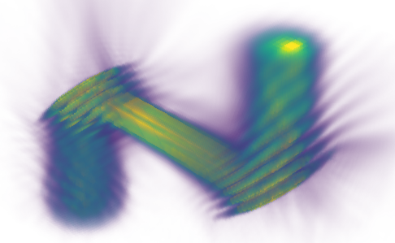

# Introduction

```
Surface Current Radiation Analysis Toolkit; Computational Helmholtz
```



`scratch` solves the electric field integral equation (EFIE) for scattering from arbitrary
perfectly-electric-conducting (PEC) surfaces, by the method of moments (MoM) with
Rao–Wilton–Glisson (RWG) basis functions [1].

# The physical problem

An incident field $\mathbf{E}^i$ illuminates a PEC surface $S$. The boundary condition — the
tangential electric field vanishes on a perfect conductor — relates the (unknown) induced surface
current $\mathbf{J}$ on $S$ to $\mathbf{E}^i$ through the retarded mixed-potential integral
equation:

$$\hat{\mathbf n}\times\mathbf E^i(\mathbf r) = \hat{\mathbf n}\times\Big[j\omega\mathbf A(\mathbf r) + \nabla\Phi(\mathbf r)\Big], \qquad \mathbf r \in S$$

with the vector potential

$$\mathbf A(\mathbf r) = \mu \int_S \mathbf J(\mathbf r')\, G(\mathbf r, \mathbf r')\, dS'$$

and scalar potential

$$\Phi(\mathbf r) = \frac{j}{\omega\varepsilon} \int_S \big[\nabla_s'\cdot \mathbf J(\mathbf r')\big]\, G(\mathbf r, \mathbf r')\, dS'$$

(the scalar potential follows from the surface continuity equation $\nabla_s\cdot\mathbf J = -j\omega\sigma$, i.e. $\sigma = \frac{j}{\omega}\nabla_s\cdot\mathbf J$), and the free-space Green's function

$$G(\mathbf r, \mathbf r') = \frac{e^{-jk|\mathbf r - \mathbf r'|}}{4\pi|\mathbf r - \mathbf r'|}, \qquad k = \frac{2\pi}{\lambda} = \frac{\omega}{c}.$$

# Discretization: RWG basis functions

$S$ is triangulated, and the current is expanded over the mesh's interior edges,

$$\mathbf J(\mathbf r) = \sum_{n=1}^{N} I_n\, \mathbf f_n(\mathbf r),$$

using the Rao–Wilton–Glisson basis function of edge $n$ [1]. Each interior edge is shared by two
triangles $T_n^+, T_n^-$ with respective free (non-shared) vertices $\mathbf r_n^+, \mathbf r_n^-$
and areas $A_n^+, A_n^-$; with $l_n$ the shared edge length,

$$\mathbf f_n(\mathbf r) = \begin{cases} \dfrac{l_n}{2A_n^+}\big(\mathbf r - \mathbf r_n^+\big), & \mathbf r \in T_n^+ \\[8pt] \dfrac{l_n}{2A_n^-}\big(\mathbf r_n^- - \mathbf r\big), & \mathbf r \in T_n^- \\[6pt] 0, & \text{otherwise}, \end{cases} $$

the divergence is given by,

$$\nabla_s\cdot \mathbf f_n(\mathbf r) = \begin{cases} \dfrac{l_n}{A_n^+}, & \mathbf r \in T_n^+ \\[6pt] -\dfrac{l_n}{A_n^-}, & \mathbf r \in T_n^-. \end{cases}$$

$\mathbf f_n$ is continuous across the shared edge, divergence-free everywhere else, and represents
a current of uniform total flow $l_n$ across that edge — the RWG basis exists precisely so surface
current can be expanded edge-by-edge without introducing spurious line charges at triangle
boundaries.

# The linear system

Testing the EFIE with the same basis, $\langle \mathbf f_m, \cdot\rangle$ (evaluated here at each
testing function's own $T_m^+/T_m^-$ centroids $\mathbf r_{c,m}^{\pm}$), turns the integral equation
into a dense linear system

$$\mathsf Z \mathbf I = \mathbf V,$$

$$
\begin{aligned}
Z_{mn} = l_m\Bigg[&j\omega\left(
  \frac{\mathbf A_{mn}(\mathbf r_{c,m}^+)\cdot \boldsymbol\rho_{c,m}^+}{2}
  + \frac{\mathbf A_{mn}(\mathbf r_{c,m}^-)\cdot \boldsymbol\rho_{c,m}^-}{2}
\right) \\
&+ \Phi_{mn}(\mathbf r_{c,m}^-) - \Phi_{mn}(\mathbf r_{c,m}^+) \Bigg]
\end{aligned}
$$

$$
V_m = l_m\left(
  \frac{\mathbf E^i(\mathbf r_{c,m}^+)\cdot \boldsymbol\rho_{c,m}^+}{2}
  + \frac{\mathbf E^i(\mathbf r_{c,m}^-)\cdot \boldsymbol\rho_{c,m}^-}{2}
\right)
$$

where $\mathbf A_{mn}, \Phi_{mn}$ denote $\mathbf A, \Phi$ due to source basis $\mathbf f_n$ alone,
and $\boldsymbol\rho_{c,m}^+ = \mathbf r_{c,m}^+ - \mathbf r_m^+$,
$\boldsymbol\rho_{c,m}^- = \mathbf r_m^- - \mathbf r_{c,m}^-$ are each testing triangle's
centroid-to-free-vertex vectors [1, eq. 17–20]. $N$ (the number of interior mesh edges) unknown
current coefficients $I_n$ are solved for via GMRES.

# Radiated field reconstruction

Given the solved $I_n$ (and hence $\mathbf J$ and, via continuity, $\sigma$), the scattered field at
any point in free space — on the mesh itself or at a remote probe — follows from the same
mixed-potential form, now evaluated off the boundary (so no tangential projection is needed):

$$\mathbf E(\mathbf r) = -j\omega\mathbf A(\mathbf r) - \nabla\Phi(\mathbf r).$$

# Physical optics and the Stratton-Chu integral

`scratch.chu` and `scratch.po` provide a second, faster (but approximate) route to the same class
of problem — radiating fields between surfaces (source aperture → mirror → mirror → probe) without
solving the RWG/MoM linear system at all. Both start from the surface equivalence principle: given
the tangential $\mathbf E, \mathbf H$ on a surface $S$, the field they produce everywhere on one
side of $S$ is exactly reproduced by equivalent surface currents

$$\mathbf J_s = \hat{\mathbf n}\times\mathbf H,$$

$$\mathbf M_s = \mathbf E\times\hat{\mathbf n},$$

with $\hat{\mathbf n}$ the surface normal pointing into the region where the field is being
reconstructed (i.e. away from the source, toward the observation side).

## Stratton-Chu radiation (`scratch.chu`)

Radiating $\mathbf J_s, \mathbf M_s$ through free space gives the Stratton-Chu integral [4]

$$
\begin{aligned}
\mathbf E(\mathbf r) = \int_S\Big[
  &j\omega\mu\,\mathbf J_s\,G \\
  {}-{}&\mathbf M_s\times\nabla' G \\
  {}+{}&(\hat{\mathbf n}'\cdot\mathbf E')\,\nabla' G
\Big]\,dS'
\end{aligned}
$$

$$
\begin{aligned}
\mathbf H(\mathbf r) = \int_S\Big[
  &j\omega\varepsilon\,\mathbf M_s\,G \\
  {}+{}&\mathbf J_s\times\nabla' G \\
  {}+{}&(\hat{\mathbf n}'\cdot\mathbf H')\,\nabla' G
\Big]\,dS'
\end{aligned}
$$

using the same free-space Green's function $G$ as above, with

$$\nabla' G(\mathbf r,\mathbf r') = \left(\frac{1}{R}+jk\right)G(\mathbf r,\mathbf r')\,\hat{\mathbf R}$$

$$\mathbf R = \mathbf r-\mathbf r', \qquad \hat{\mathbf R}=\mathbf R/R$$

the gradient of $G$ with respect to the source point $\mathbf r'$. Unlike the near-field terms
dropped in a pure far-field pattern calculation, this form is exact at any distance, so it can be
applied surface-to-surface (aperture → mirror → mirror) as well as to a distant probe.

## The PEC boundary condition and physical optics (`scratch.po`)

When $S$ is itself a PEC surface illuminated by an incident field $\mathbf E^i,\mathbf H^i$
(rather than a boundary carrying an already-known total field), the physical-optics
(Kirchhoff) approximation replaces the true induced current with the one an infinite tangent
plane would carry: on the illuminated region, the total tangential $\mathbf H$ doubles and the
total normal $\mathbf E$ doubles, while total tangential $\mathbf E$ and normal $\mathbf H$ vanish
(the PEC boundary condition) —

$$\mathbf E_n = 2\mathbf E_n^i, \qquad \mathbf H_t = 2\mathbf H_t^i,$$

$$\mathbf E_t = 0, \qquad \mathbf H_n = 0,$$

equivalently, the induced physical-optics current is

$$\mathbf J_{PO} = \hat{\mathbf n}\times\mathbf H = 2\,\hat{\mathbf n}\times\mathbf H^i.$$

`scratch.chu.radiate` applies this as a post-processing step on any probe flagged `.pec` (so a
mirror's outgoing field becomes the next stage's equivalent source); `scratch.po.radiate` builds
$\mathbf J_{PO}$ directly from the incident $\mathbf H$ and radiates it in one step via the exact
near-field dyadic Green's function of a surface current (no $\mathbf M_s$ term, since a PEC current
alone reproduces the correct field on the illuminated side) [5, eq. 4-8/4-9]. For an imperfectly
conducting (resistive) surface, a Leontovich impedance boundary condition adds a tangential
correction

$$\mathbf E_t \approx Z_m\,\mathbf J_{PO},$$

$$Z_m = (1+j)\sqrt{\pi f\mu_0\rho},$$

with $Z_m$ the surface impedance of a conductor of resistivity $\rho$ at frequency $f$, from the
usual good-conductor skin-depth result.

# References

1. S. M. Rao, D. R. Wilton, and A. W. Glisson, "Electromagnetic scattering by surfaces of arbitrary
   shape," *IEEE Transactions on Antennas and Propagation*, vol. AP-30, no. 3, pp. 409–418, May 1982.
2. R. F. Harrington, *Field Computation by Moment Methods*. Macmillan, 1968 (reissued, IEEE Press,
   1993) — the general method-of-moments framework RWG basis functions are built on.
3. W. C. Gibson, *The Method of Moments in Electromagnetics*, 2nd ed. CRC Press, 2014 — a modern
   treatment of RWG-based MoM, including implementation-level detail (matrix assembly, radiation
   integrals, fast solvers).
4. J. A. Kong, *Electromagnetic Wave Theory*. Cambridge, MA: EMW Publishing, 2000 — the
   Stratton-Chu surface-equivalence radiation integral used by `scratch.chu`.
5. C. A. Balanis, *Antenna Theory: Analysis and Design*, 4th ed. Wiley, 2016 — physical-optics/
   Kirchhoff PEC boundary condition and the exact near-field radiation integral of a surface
   current, used by `scratch.po`.

# Licensing

Contact alex@horizonelectro.com for licensing options or a trial.
